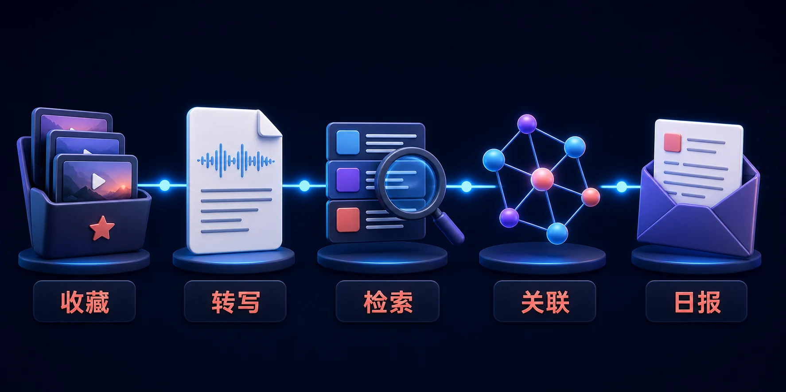

<!-- README-PROMO:START -->
<p align="center">
  
  
  
</p>
<!-- README-PROMO:END -->

# AutoAI 🧠

> 抖音AI收藏视频 → 自动下载 → Whisper转写 → 向量检索 → 知识图谱
> 
> **把抖音变成你的第二大脑。收藏即学习，检索即回忆。**

[](https://www.python.org/)
[](https://www.microsoft.com/windows)
[](LICENSE)
[](https://github.com/openvinotoolkit/openvino)

## 这是什么？

你在抖音上收藏了几百个AI教程、开源项目、技术分享视频——但收藏后就再也没看过。

**AutoAI** 把"收藏"变成"知识"：
- 📥 自动下载视频音轨
- 🎙️ 用本地 Whisper 转写成文字（完全离线，不花API钱）
- 🔍 建立全文检索 + 语义向量索引
- 🕸️ 自动构建知识图谱，发现关联
- 📧 每天9:00推送AI趋势日报到邮箱
- 🔄 增量同步新收藏，全自动

## 快速开始

### 1. 克隆

```bash
git clone https://github.com/DaBaoAgent/AutoAI.git
cd AutoAI
```

### 2. 安装

```bash
# 创建虚拟环境
python -m venv .venv
.venv\Scripts\activate

# 安装依赖
pip install -r requirements.txt

# 安装 Playwright 浏览器（用于绕抖音限流）
playwright install chromium
```

### 3. 导入收藏

```bash
# 把你的抖音收藏导出为 JSON
# 格式参考: data/sources/douyin_favorites_example.json
# 然后:
python -m dabo_kb.cli ingest data/sources/your_favorites.json --replace-source
```

### 4. 一键处理

```bash
# 全自动：抓取 → 下载 → 转写
python -m dabo_kb.cli process-all --count 50 --batch-size 10 --parallel-workers 1

# 查看进度
python -m dabo_kb.cli status
```

### 5. 检索

```bash
# 全文搜索
python -m dabo_kb.cli search "浏览器自动化" --limit 8

# 语义搜索（向量）
python -m dabo_kb.cli search "如何用AI做视频剪辑" --semantic --limit 5
```

## 核心功能

| 功能 | 说明 |
|------|------|
| 🔊 **离线转写** | OpenVINO int8量化Whisper，4核CPU跑base模型10-15x实时 |
| 🔍 **双重检索** | SQLite FTS5全文 + paraphrase-multilingual语义向量 |
| 🕸️ **知识图谱** | 自动提取实体关系，GraphML可视化 |
| 🤖 **自适应迭代** | 抖音限流自动退避、Playwright浏览器回退、死信队列重试 |
| 📧 **日报推送** | GitHub Trending + 知识图谱最新 → Markdown日报 → QQ邮箱 |
| 🔄 **增量同步** | 每6h自动检测新收藏，全自动入库 |

## 项目结构

```
AutoAI/
├── src/dabo_kb/           # 核心Python模块
│   ├── cli.py             # CLI入口
│   ├── pipeline.py        # 全自动编排
│   ├── acquire.py         # 抖音抓取/下载
│   ├── openvino_asr.py    # OpenVINO转写引擎
│   ├── ocr.py             # 视频画面OCR
│   ├── search.py          # 全文/语义检索
│   ├── vector.py          # 向量索引
│   ├── graph.py           # 知识图谱构建
│   └── db.py              # SQLite数据层
├── playwright_fetch.py    # 🆕 Playwright绕过抖音限流
├── sync_favorites.py      # 🆕 增量收藏自动同步
├── requirements.txt
└── README.md
```

## 为什么用 OpenVINO 而不是 API？

- **零成本**：完全不调任何付费API，4核笔记本CPU跑满
- **隐私**：你的收藏数据全程离线，不经过任何云端
- **速度**：base模型 10-15x 实时（1分钟视频7秒转完）

## 关键踩坑

> 详见项目 skill 文档的"关键发现"章节

1. **抖音curl限流**：用 Playwright + 移动端UA 绕过
2. **并行转录反降速**：`--parallel-workers 1` 才是最优
3. **新SSR格式**：`music`对象不再含`play_url`，需从视频提音轨
4. **Chrome Profile复用**：`launch_persistent_context` 继承登录态

## 贡献者

**大宝 (DaBao)** — 项目作者 & 维护者

欢迎提 Issue 和 PR！适合新手的任务已标 `good first issue`。

## License

MIT © 大宝
